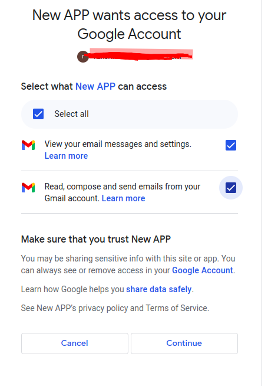

# Mail Inbox 

## About 

A python script that parse your gmail inbox and marks them read, and adds a label based on a set of rules.

## Installation and Setup

+ Generate credentials for an oauth desktop application and save credentials to credentials.json [docs](https://developers.google.com/gmail/api/quickstart/python#authorize_credentials_for_a_desktop_application) 

+ Clone the repository
    ```
    git clone https://github.com/Rakshith-SS/read_inbox.git
    ```
+ Install the necessary packages.
    ```
    python -m pip install -r requirements.txt
    ```
+ Add Environment Variables 
    + [ ] Create a database using postgres
    + [ ] Create a new file named .env
    + [ ] Add the following values to the .env file.
    ```
    DB_USER = '<DATABASE_USER_NAME>'
    DB_PASSWORD = '<DATABASE_PASSWORD>'
    DB_HOST = '<DATABASE_HOST>'
    DB_NAME = '<DATABASE_NAME>'
    ```

## Running the script

+ [ ] To run the script simply run 
    ```
        python main.py
    ```
    
    when running for the first time, you will be asked to allow permission

     

+ [ ] Editing the rules
    You can edit the rules of the app, by editing rules.json, you can add as many rules to all and any list objects.

    Sample file
    ```
    {
        "all": [
            {
                "From": {
                    "value": "Rakshith S S",
                    "predicate": "contains",
                    "field": "sender"
                },
                "Subject":{
                    "value": "New",
                    "predicate": "contains",
                    "field": "subject"
                },
                "Date":{
                    "value": 3,
                    "predicate": "less than",
                    "field": "date_received"
                }
            }
        ],
        "any": [
            {
                "From": {
                    "value": "Arch",
                    "predicate": "contains",
                    "field": "sender"
                },
                "Subject":{
                    "value": "New",
                    "predicate": "contains",
                    "field": "subject"
                },
                "Date":{
                    "value": 1,
                    "predicate": "less than",
                    "field": "date_received"
                }
            }
        ]
    }
    ```
